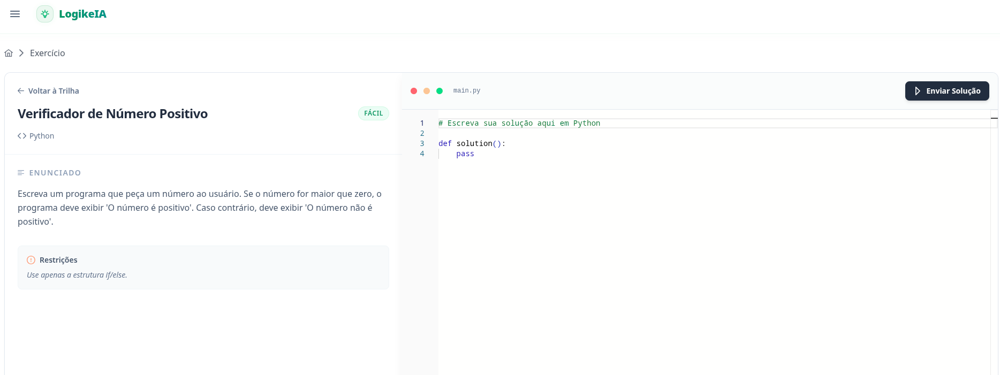
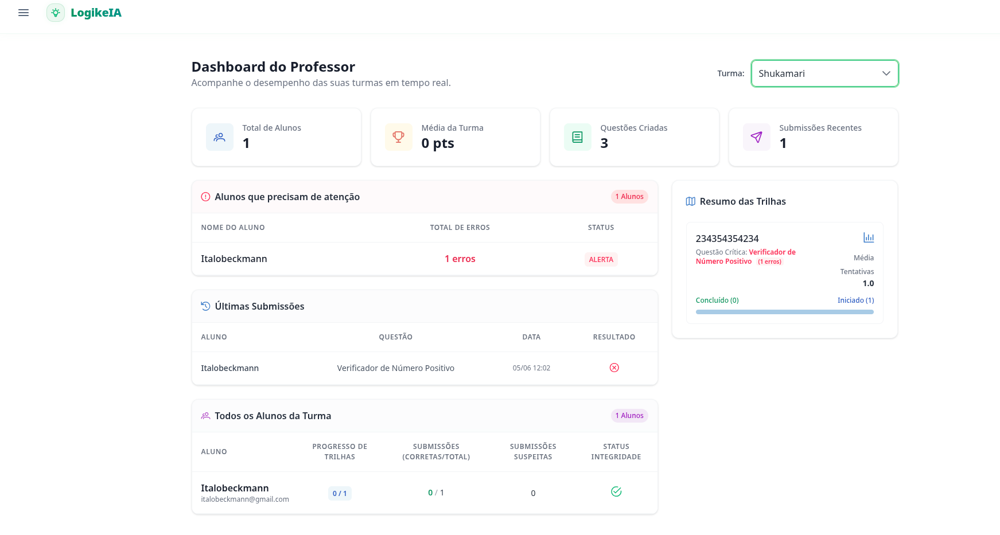
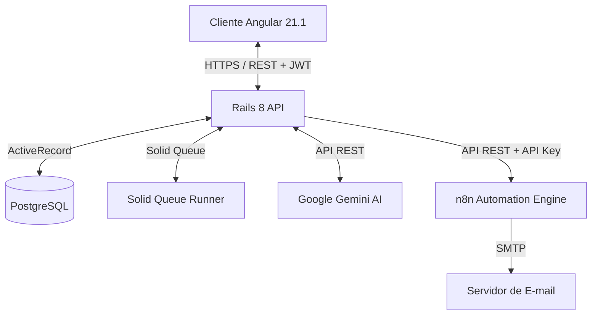

# 🎓 LogikeIA — Plataforma de Ensino de Lógica com IA

O **LogikeIA** é uma plataforma moderna e interativa voltada para o ensino e aprendizagem de lógica de programação Python. Utilizando Inteligência Artificial de forma assíncrona (Google Gemini API), o sistema provê uma experiência de tutoria socrática e altamente personalizada para os estudantes. Para os educadores, o LogikeIA oferece um ecossistema analítico completo com dashboards e relatórios de progresso em tempo real.

Este repositório foi desenvolvido como projeto central da disciplina de **Estágio Supervisionado** em desenvolvimento de software.

---

### 🛠️ Tecnologias Utilizadas

<div align="left">
  
  
  
  
  
  
</div>

---

## 📖 Sumário

1. [Demonstração Visual](#-demonstração-visual)
2. [Principais Funcionalidades](#-principais-funcionalidades)
3. [Arquitetura do Sistema](#-arquitetura-do-sistema)
4. [Estrutura do Repositório](#-estrutura-do-repositório)
5. [Configuração do Ambiente (Setup)](#-configuração-do-ambiente-setup)
6. [Interface de Comandos Rápida (Makefile)](#-interface-de-comandos-rápida-makefile)
7. [Documentações Adicionais](#-documentações-adicionais)

---

## 📸 Demonstração Visual

| Tela de Exercícios (Aluno) | Dashboard Analítico (Professor) |
|:---:|:---:|
|  |  |
| *Área de desenvolvimento, terminal de execução e feedback do Tutor Socrático IA.* | *Gráficos de progresso das turmas e estatísticas de submissão.* |

---

## 🌟 Principais Funcionalidades

### 👨‍🎓 Visão do Aluno
*   **Editor de Código Interativo:** Interface web limpa para codificação e validação de scripts Python diretamente no navegador.
*   **Trilhas de Aprendizagem (Playlists):** Jornadas organizadas por nível de dificuldade com navegação sequencial obrigatória.
*   **Tutor Socrático IA:** Motor baseado na API do Gemini que orienta o aluno apontando caminhos lógicos por meio de perguntas reflexivas, ao invés de simplesmente entregar o código pronto.
*   **Gamificação:** Placa de líderes (leaderboard) global e restrito por turmas para impulsionar a participação.

### 👩‍🏫 Visão do Professor
*   **Gerenciamento de Turmas (Classrooms):** Criação rápida de turmas, controle de ingresso via códigos de acesso e moderação de alunos.
*   **Geração de Questões Assistida por IA:** Criação automatizada de enunciados, casos de testes e soluções padrão baseados em prompts, rodando em background.
*   **Dashboard Pedagógico:** Painéis com gráficos (barra, rosca) detalhando a taxa de conclusão de trilhas e médias de acertos.
*   **Métricas Individuais:** Consulta ao perfil detalhado do aluno contendo estatísticas de submissões e histórico de atividade.

---

## 🏛️ Arquitetura do Sistema

O sistema é construído utilizando uma arquitetura desacoplada de API Restful + Cliente Single Page Application (SPA), integrando processamento de jobs assíncronos e orquestração de serviços de suporte.



---

## 📁 Estrutura do Repositório

O projeto adota uma estrutura de monorepo simplificada para facilitar a coordenação das entregas de frontend e backend:

```text
estagio-frontend/
├── api-logike-estagio/      # Código do Backend (Ruby on Rails 8 API)
│   ├── app/                 # Controllers, Models, Jobs, Services e Serializers
│   ├── config/              # Rotas, ambientes e inicializadores
│   ├── db/                  # Migrações e scripts de seed
│   ├── spec/                # Suíte de testes (RSpec)
│   └── Makefile             # Automação de tarefas e Docker
├── frontend/                # Código do Frontend (Angular 21.1 SPA)
│   ├── src/                 # Componentes, Guards, Interceptors e Serviços
│   ├── package.json         # Manifesto de dependências do Node.js
│   └── tsconfig.json        # Configuração do compilador TypeScript
├── docs/
│   └── assets/              # Assets de documentação (Screenshots e diagramas)
├── STATUS_PROJETO.md        # Quadro Kanban técnico e lista de pendências
└── README.md                # Este guia de introdução
```

---

## 🚀 Configuração do Ambiente (Setup)

### 📋 Pré-requisitos
Antes de começar, garanta que possui instalado:
*   [Docker & Docker Compose](https://www.docker.com/) (altamente recomendado)
*   [Node.js](https://nodejs.org/) (Versão 20 LTS ou superior)
*   [Git](https://git-scm.com/)

---

### 1. Inicializando o Backend (API)

O backend do LogikeIA é conteinerizado e pode ser preparado rapidamente através de utilitários no `Makefile`.

1. Navegue até a pasta do backend:
   ```bash
   cd api-logike-estagio
   ```

2. Crie e configure o seu arquivo de variáveis de ambiente:
   ```bash
   cp .env.example .env
   ```
   > [!IMPORTANT]
   > Abra o arquivo `.env` gerado e preencha a propriedade `GEMINI_API_KEY` para que o tutor socrático com IA funcione adequadamente.

3. Execute o setup inicial (criação de redes, build de containers e migração do banco de dados com dados iniciais de seed):
   ```bash
   make setup
   ```

4. Suba os containers do Rails, do PostgreSQL e do fila do Solid Queue runner:
   ```bash
   make up
   ```
   * A API iniciará no endereço `http://localhost:3000`.
   * A documentação interativa OpenAPI/Swagger estará acessível em `http://localhost:3000/api-docs`.

---

### 2. Inicializando o Frontend (Web)

O frontend roda localmente via NodeJS gerenciando o servidor do Angular.

1. Abra outro terminal e acesse a pasta correspondente:
   ```bash
   cd frontend
   ```

2. Instale todas as dependências requeridas pelo ecossistema do cliente:
   ```bash
   npm install
   ```

3. Suba o servidor de desenvolvimento local:
   ```bash
   npm run start
   ```
   * O dashboard e interface do usuário estarão disponíveis em `http://localhost:4200`.

---

## ⚡ Interface de Comandos Rápida (Makefile)

Para facilitar a administração do servidor Rails dentro do container, o `Makefile` na pasta `api-logike-estagio` expõe os seguintes atalhos:

| Comando | Descrição |
|:---|:---|
| `make setup` | Cria as redes Docker, reconstrói imagens e executa setup de banco de dados. |
| `make up` | Inicia todos os serviços necessários em background. |
| `make stop` | Para os containers em execução sem excluir os dados persistidos. |
| `make down` | Remove os containers, redes e volumes associados. |
| `make logs` | Exibe o stream de logs unificados (Rails + Solid Queue + DB). |
| `make console` | Acessa o console interativo do Rails (`rails console`) dentro do container ativo. |
| `make db.migrate` | Roda as migrações pendentes no banco de dados do container. |
| `make test` | Executa a suíte de testes automatizados com RSpec. |

---

## 📖 Documentações Adicionais

Para especificações detalhadas e acompanhamento do ciclo de vida de desenvolvimento, você pode consultar:

*   **[Documentação da API Backend](./api-logike-estagio/api_documentation.md):** Manual com contratos de endpoints, esquemas JSON e exemplos de resposta da API Rails.
*   **[Setup Estendido do Backend](./api-logike-estagio/LOGIKEIA_SETUP.md):** Passo a passo detalhado de troubleshooting de Docker e dependências no ambiente backend.
*   **[Especificações do Produto (PRD)](./frontend/PRD.MD):** O documento de requisitos do produto contendo a visão de negócios e regras do LogikeIA.

---
*Desenvolvido como projeto final prático para a disciplina de Estágio Supervisionado 2026/1.*
